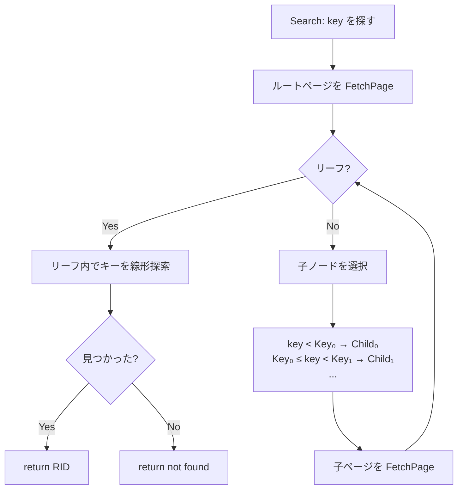
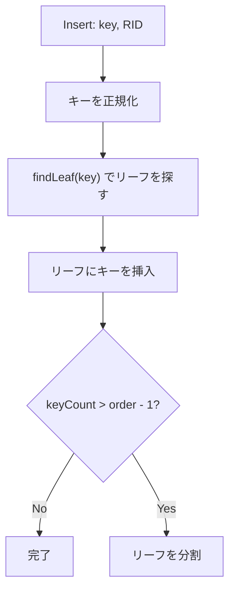
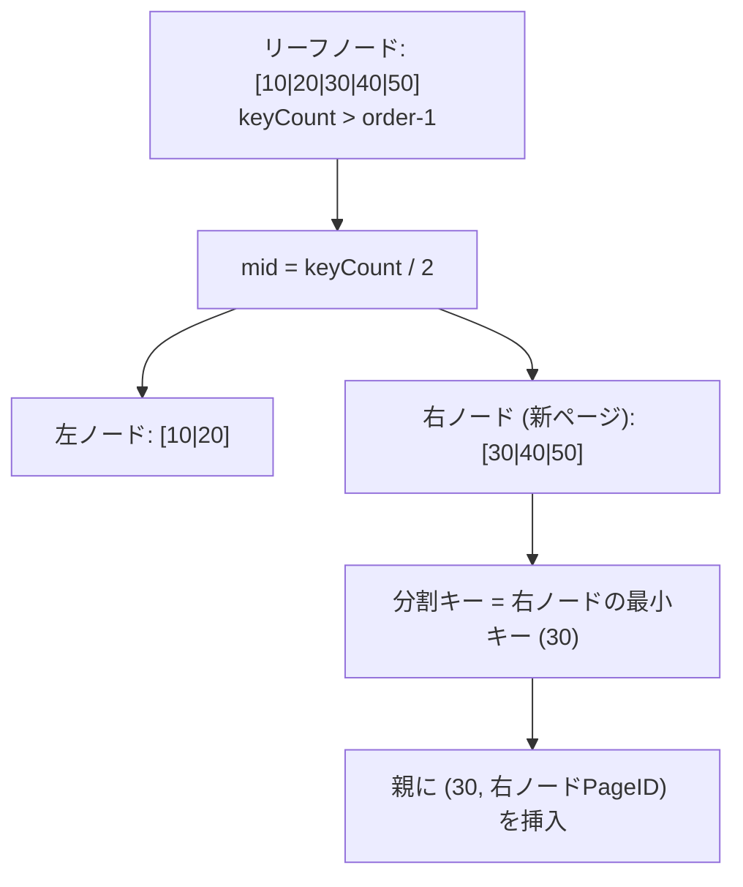
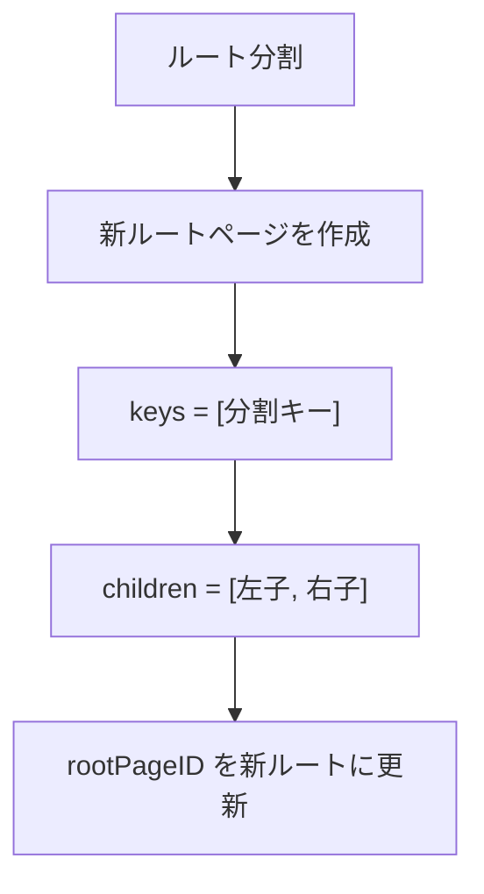

# B-Tree インデックス

テーブルのキーに対する高速な検索を提供するツリー構造のインデックス。ディスクベースのデータベースに最適な自己平衡型の探索木。

対応ソース: `internal/index/btree.go`

---

## 1. B-Tree の基礎

### なぜ B-Tree か

ハッシュテーブルは等値検索は O(1) だが範囲検索ができない。二分探索木は O(log n) だが、ノードが 1 つのキーしか持たないためディスク I/O が多い。

B-Tree は 1 ノードに**多数のキー**を格納し、ノード 1 つ = ディスク 1 ページに対応させることで：

- **ディスク I/O を最小化**: 木の高さが低い（数百万件でも 3〜4 レベル）
- **範囲検索が可能**: リーフノードを順に走査できる
- **自己平衡**: 挿入・削除で木の高さが偏らない

### 次数（Order）

minidb では、1 ページに格納できるエントリ数から次数を計算する：

```go
usableSpace := PageSize(4096) - PageHeaderSize(28) - btreeHeaderSize(4)
leafEntrySize := keySize + ridSize(12)
order := usableSpace / leafEntrySize  // 最低 3
```

例えばキーサイズ 64 バイトの場合：`(4096 - 28 - 4) / (64 + 12) = 53`

---

## 2. ノードフォーマット

### B-Tree ヘッダ（4 バイト、ページヘッダの後）

```
offset              size  field
───────────────────────────────
PageHeaderSize+0    1     IsLeaf    (1=リーフ, 0=内部)
PageHeaderSize+1    2     KeyCount  キーの数
PageHeaderSize+3    1     Reserved
```

### リーフノードのレイアウト

```
┌─────────────────────────────────────┐
│ Page Header (28 bytes)              │
├─────────────────────────────────────┤
│ B-Tree Header (4 bytes)             │
│   IsLeaf=1 | KeyCount              │
├─────────────────────────────────────┤
│ Key₀ (keySize B) │ RID₀ (12 B)     │
│ Key₁ (keySize B) │ RID₁ (12 B)     │
│ Key₂ (keySize B) │ RID₂ (12 B)     │
│ ...                                 │
└─────────────────────────────────────┘
```

各エントリはキーと RID（行の物理位置）のペア。

### 内部ノードのレイアウト

```
┌─────────────────────────────────────┐
│ Page Header (28 bytes)              │
├─────────────────────────────────────┤
│ B-Tree Header (4 bytes)             │
│   IsLeaf=0 | KeyCount              │
├─────────────────────────────────────┤
│ Child₀ (4 B)                        │
│ Key₀ (keySize B) │ Child₁ (4 B)    │
│ Key₁ (keySize B) │ Child₂ (4 B)    │
│ ...                                 │
└─────────────────────────────────────┘
```

内部ノードは `KeyCount + 1` 個の子ポインタ（PageID）を持つ。

### RID 構造（12 バイト）

```
offset  size  field
───────────────────
 0      4     PageID     タプルが格納されたページ
 4      2     SlotNum    ページ内のスロット番号
 6      2     Padding
 8      4     TableID    テーブル ID
```

---

## 3. 検索アルゴリズム

ルートノードからリーフノードまで、各内部ノードでキーを比較して適切な子ノードを選択する。



走査パス上の全ページは Pin され、検索完了後に Unpin される。

### キーの正規化

キーは固定長（`keySize` バイト）に正規化される。短いキーはゼロパディング、長いキーは切り詰められる。

```go
func (bt *BTree) normalizeKey(key []byte) []byte {
    k := make([]byte, bt.keySize)
    copy(k, key)  // 短ければ残りは 0
    return k
}
```

---

## 4. 挿入とリーフ分割

### 挿入の流れ



### リーフ内の挿入

キーの挿入位置をバイナリ比較で見つけ、既存エントリをシフトして挿入する。同じキーが存在する場合は RID を上書き（更新）する。

### リーフ分割



### 新ルート生成

ルートノードが分割される場合（パスが空の場合）、新しいルートページを作成する：



### 内部ノード分割

内部ノードが満杯になった場合も分割する。中間のキーを親に**昇格（promote）**させる点がリーフ分割と異なる：

```
元:     [10|20|30|40|50] + 6つの子ポインタ
  ↓
左:     [10|20]           + 3つの子ポインタ
右:     [40|50]           + 3つの子ポインタ
昇格:   30 を親に挿入
```

---

## 5. 削除

キーの削除は、リーフノードからキーを除去する単純な操作として実装されている。

```go
for i := 0; i < node.keyCount; i++ {
    if bytes.Equal(node.keys[i], key) {
        // シフトして削除
        copy(node.keys[i:], node.keys[i+1:])
        copy(node.values[i:], node.values[i+1:])
        node.keyCount--
        break
    }
}
```

minidb では**マージ**や**再分配**は実装されていない。ノードがアンダーフローしても木の構造は変わらない（教育目的のシンプルな実装）。

---

## 6. 全件スキャンと範囲スキャン

### ScanAll

ルートから再帰的に全ノードを走査し、すべてのリーフの RID を収集する。

```go
func (bt *BTree) scanNode(pageID, results) {
    if node.isLeaf {
        // 全キーの RID を追加
    } else {
        // 全子ノードを再帰的に走査
        for i := 0; i <= keyCount; i++ {
            scanNode(children[i], results)
        }
    }
}
```

### RangeScan

開始キーでリーフを見つけ、範囲内のキーを収集する。現在の実装ではリーフ間のシブリングポインタがないため、単一リーフ内の範囲のみ対応（TODO として記録されている）。

---

## 7. ツリー構造の例

```
                    [30|60]                    ← 内部ノード（ルート）
                   /   |   \
             [10|20] [40|50] [70|80]           ← リーフノード
               ↓       ↓       ↓
             RIDs     RIDs    RIDs             ← 各キーに対応する行位置
```

検索例: `key = 45`
1. ルート: `30 ≤ 45 < 60` → Child₁ へ
2. リーフ `[40|50]`: `40` と `50` を比較 → `45` は見つからない
