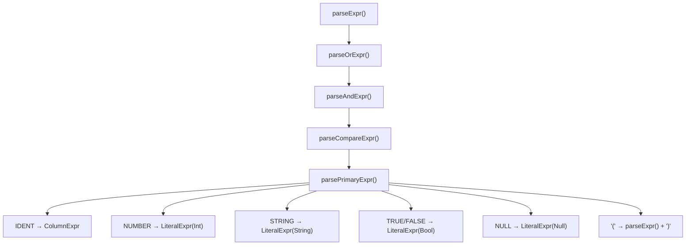
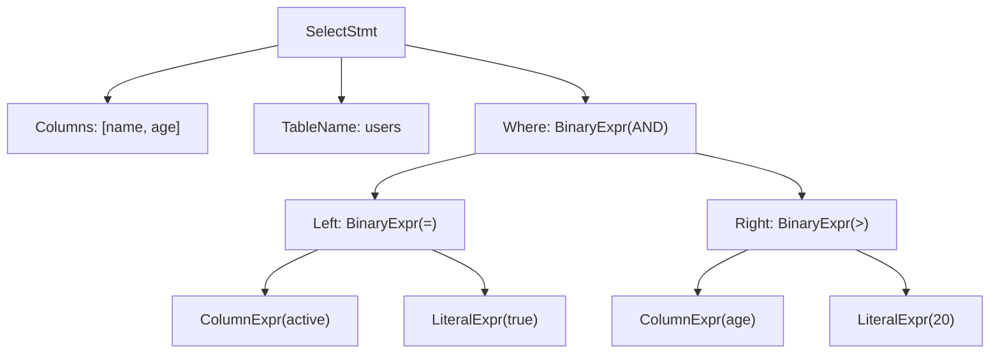
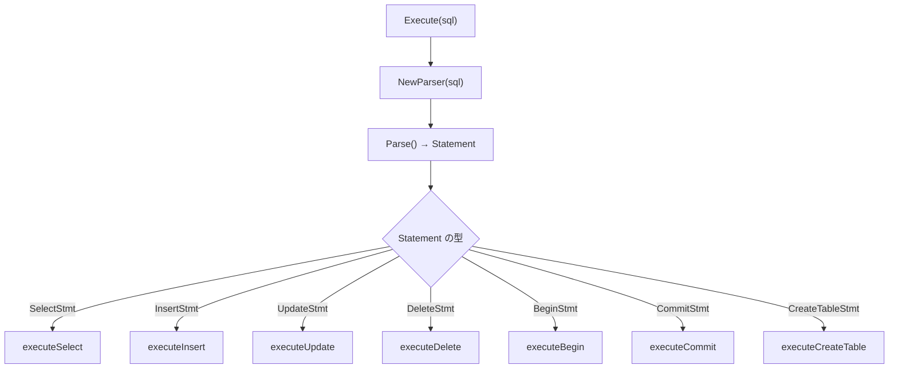
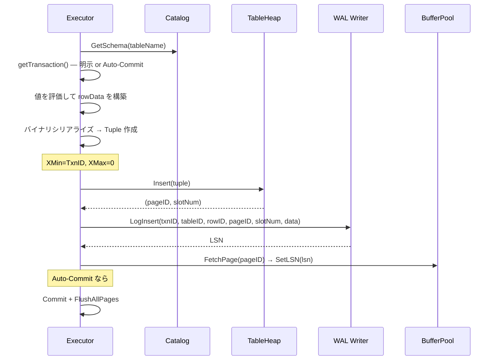
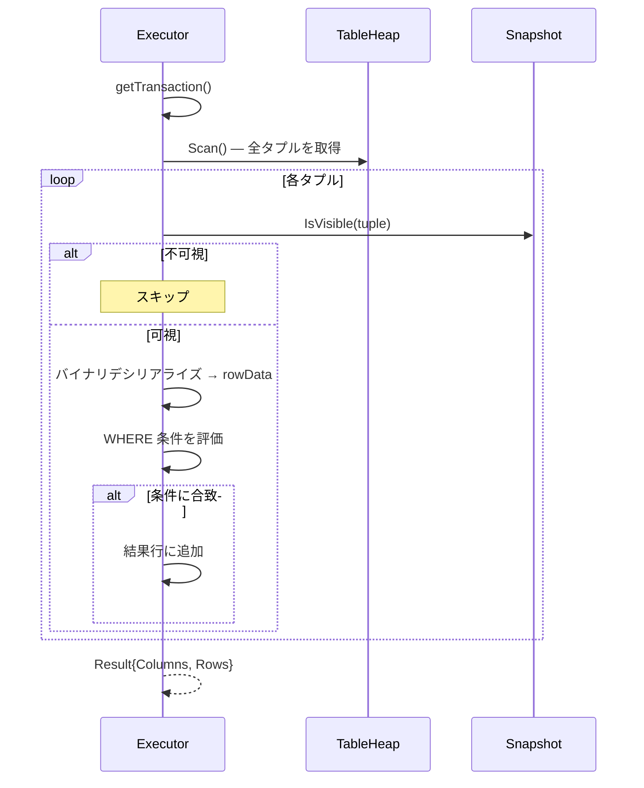

# SQL パーサーと実行エンジン

SQL 文字列を解析して実行する最上位レイヤー。字句解析 → 構文解析 → 実行の 3 段階で処理する。

対応ソース: `internal/sql/lexer.go`, `parser.go`, `executor.go`

---

## 1. 字句解析（Lexer）

### 役割

SQL 文字列をトークン列に分解する。空白をスキップし、キーワード・識別子・リテラル・演算子を識別する。

### トークンタイプ一覧

| カテゴリ | トークン |
|----------|---------|
| キーワード | `SELECT`, `INSERT`, `UPDATE`, `DELETE`, `FROM`, `WHERE`, `INTO`, `VALUES`, `SET`, `AND`, `OR`, `NOT`, `NULL`, `BEGIN`, `COMMIT`, `ROLLBACK`, `CREATE`, `TABLE`, `INT`, `TEXT`, `BOOL`, `TRUE`, `FALSE` |
| リテラル | `IDENT`（識別子）, `NUMBER`（整数）, `STRING`（'...'） |
| 比較演算子 | `=`, `!=`, `<>`, `<`, `<=`, `>`, `>=` |
| 記号 | `,`, `(`, `)`, `*`, `;` |
| 特殊 | `EOF`, `ERROR` |

### キーワード判定

識別子を読み取った後、大文字変換して `keywords` マップで照合する。一致すればキーワードトークン、不一致なら `TokenIdent` として返す。

```go
literal := l.input[start : l.pos-1]
upper := strings.ToUpper(literal)
if tokenType, ok := keywords[upper]; ok {
    return Token{Type: tokenType, Literal: upper}
}
return Token{Type: TokenIdent, Literal: literal}
```

### 文字列リテラル

シングルクォートで囲まれた文字列を読み取る。エスケープシーケンスは未対応。

```
'Alice' → Token{Type: TokenString, Literal: "Alice"}
```

### 数値リテラル

先頭がマイナス記号でも次が数字なら負数として読み取る。小数点は未対応（整数のみ）。

---

## 2. 構文解析（Parser）

### 再帰下降パーサー

Parser は **2 トークン先読み**（`current` と `peek`）の再帰下降パーサーとして実装されている。

```go
type Parser struct {
    lexer   *Lexer
    current Token    // 現在のトークン
    peek    Token    // 次のトークン
    errors  []string
}
```

### 文の種類

`current` トークンで文の種類を判別する：

| 先頭トークン | AST ノード | 説明 |
|---|---|---|
| `SELECT` | `SelectStmt` | 行の取得 |
| `INSERT` | `InsertStmt` | 行の挿入 |
| `UPDATE` | `UpdateStmt` | 行の更新 |
| `DELETE` | `DeleteStmt` | 行の削除 |
| `BEGIN` | `BeginStmt` | トランザクション開始 |
| `COMMIT` | `CommitStmt` | トランザクションコミット |
| `ROLLBACK` | `RollbackStmt` | トランザクションロールバック |
| `CREATE` | `CreateTableStmt` | テーブル作成 |

### 式の文法と優先順位

式の解析は優先順位の低い順に再帰する（Pratt パーサーの変形）：

```
Expr         = OrExpr
OrExpr       = AndExpr ( "OR" AndExpr )*
AndExpr      = CompareExpr ( "AND" CompareExpr )*
CompareExpr  = PrimaryExpr ( ( "=" | "!=" | "<" | "<=" | ">" | ">=" ) PrimaryExpr )?
PrimaryExpr  = IDENT | NUMBER | STRING | TRUE | FALSE | NULL | "(" Expr ")"
```



優先順位: `OR` < `AND` < 比較演算子

### SELECT 文の解析例

```
SELECT name, age FROM users WHERE active = true AND age > 20
```



---

## 3. 実行エンジン

### 全体の処理フロー



### INSERT の実行フロー



### SELECT の実行フロー



### UPDATE の実行フロー

UPDATE は MVCC の仕組みに従い「旧バージョンの論理削除 + 新バージョンの挿入」として実行される：

1. `Scan()` で全タプルを取得
2. MVCC 可視性チェック + WHERE フィルタ
3. 旧タプルの `XMax` を現在の `TxnID` に設定（論理削除）
4. `heap.Update()` で旧タプルの XMax をディスクに書き戻し
5. 新しいデータで新タプルを作成（`XMin=TxnID`, `XMax=0`）
6. `heap.Insert()` で新タプルを挿入
7. WAL に `LogUpdate(before, after)` を記録

### DELETE の実行フロー

1. `Scan()` で全タプルを取得
2. MVCC 可視性チェック + WHERE フィルタ
3. 旧タプルの `XMax` を現在の `TxnID` に設定（論理削除）
4. `heap.Update()` でディスクに書き戻し
5. WAL に `LogDelete(before)` を記録

物理的な削除は行わない。古いバージョンのガベージコレクション（VACUUM）は未実装。

---

## 4. コミット順序

### WAL commit → flush pages

```go
// executeCommit
e.txnManager.Commit(e.currentTxn)  // WAL に COMMIT を書いて Force
e.bufferPool.FlushAllPages()        // データページをフラッシュ
```

この順序が重要な理由：

1. **WAL の COMMIT レコードが先にディスクに書かれる** — これでトランザクションは「コミット済み」と確定
2. **データページは後から書いてよい** — クラッシュしても WAL の Redo で復元可能

もし逆の順序（データページ → WAL）だと、データページを書いた後 WAL を書く前にクラッシュした場合、コミット済みかどうか判定できなくなる。

---

## 5. 条件評価

### evaluateCondition

WHERE 句の評価は再帰的に行われる：

```go
case *BinaryExpr:
    switch ex.Op {
    case TokenAnd:
        return evaluate(left) && evaluate(right)
    case TokenOr:
        return evaluate(left) || evaluate(right)
    default:  // 比較演算子
        leftVal := evaluateExpr(left, rowData)
        rightVal := evaluateExpr(right, rowData)
        return compare(leftVal, rightVal, op)
    }
```

### 比較ルール

- **NULL**: いかなる比較も `false`（SQL の NULL セマンティクス）
- **型不一致**: `false`
- **同一型**: Int は数値比較、String は辞書順比較、Bool は等値比較のみ
