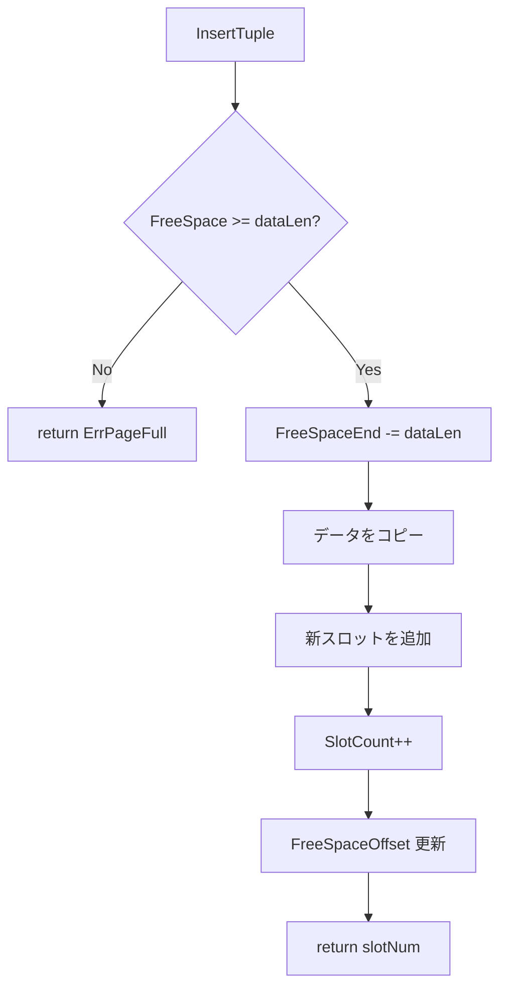
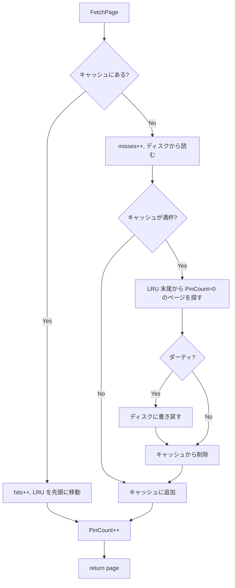
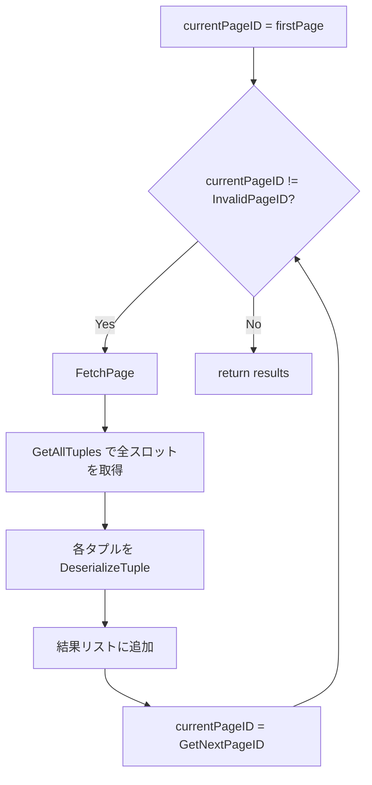
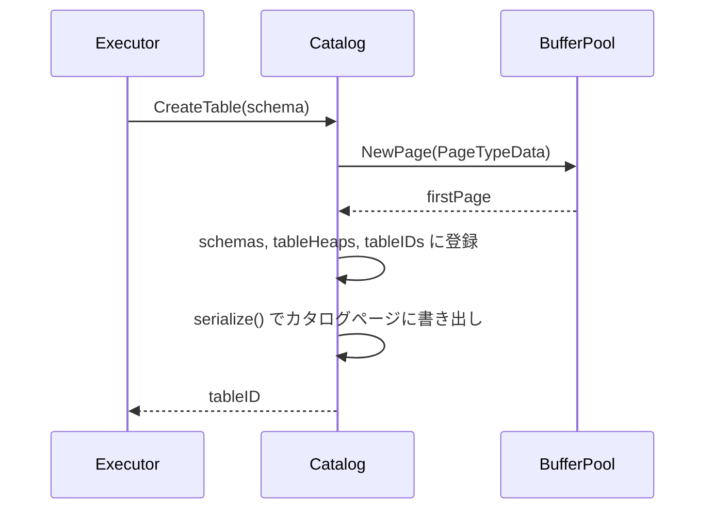
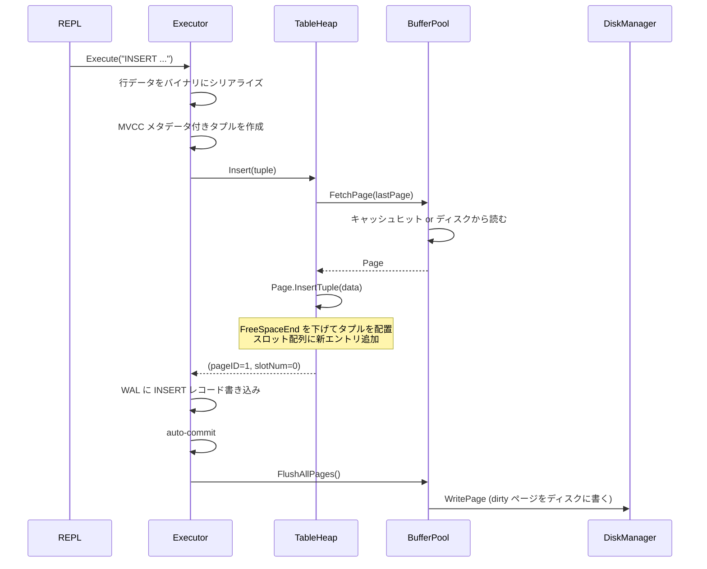
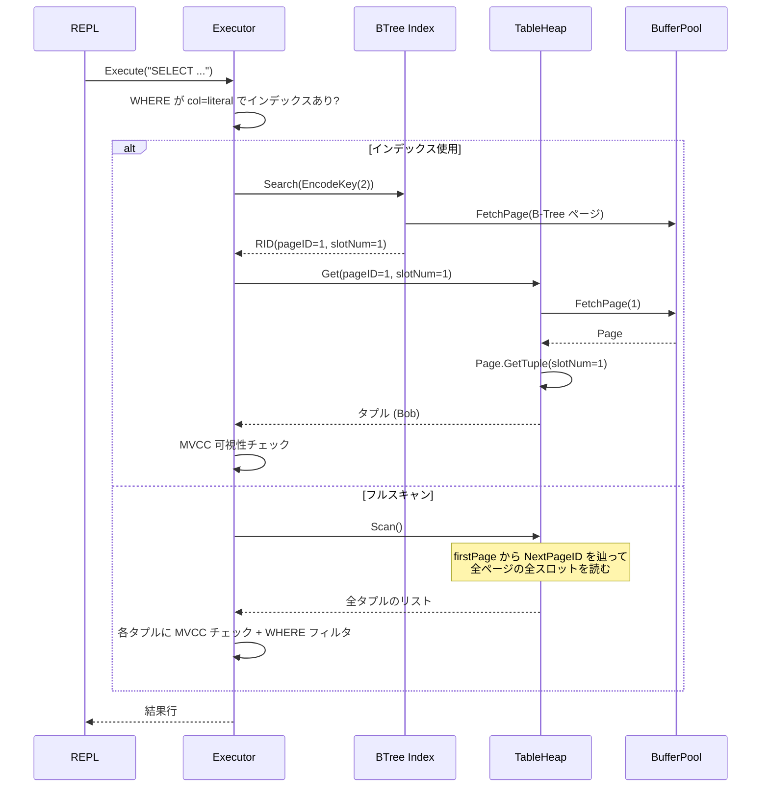

# ストレージエンジン

ディスク上のデータを管理するための最下位レイヤー。ページの読み書き、バッファキャッシュ、テーブルデータの格納を担当する。

対応ソース: `internal/storage/page.go`, `disk.go`, `buffer.go`, `heap.go`

---

## 0. ページとは何か

### 基本概念

データベースはすべてのデータを **固定サイズ 4096 バイトのページ** という単位で管理する。テーブルの行データも、インデックスも、スキーマ情報も、すべてページの中に格納される。

なぜ固定サイズか：
- ディスク I/O の最小単位を統一できる（`ReadPage` / `WritePage` は常に 4096 バイト）
- ページ ID からファイル内の物理位置を O(1) で計算できる
- メモリ管理（バッファプール）がシンプルになる

### ページの種類

minidb には 3 種類のページがある：

| Type | 値 | 用途 | 中に入るデータ |
|------|---|------|--------------|
| **Catalog** | 3 | テーブル定義の保存 | テーブル名、カラム定義、ヒープの先頭/末尾ページ、インデックス情報 |
| **Data** | 1 | テーブルの行データ | MVCC メタデータ付きのタプル（行）。Slotted Page 形式 |
| **BTree** | 2 | インデックスのノード | ソート済みキーと RID（行の物理位置）のペア |

### 具体例：テーブル作成から行挿入まで

```sql
CREATE TABLE users (id INT, name TEXT)
INSERT INTO users VALUES (1, 'Alice')
INSERT INTO users VALUES (2, 'Bob')
create index on users(id)
```

この操作で `data.db` ファイルにはこういうページ配置が生まれる：

```
data.db ファイル
┌──────────────────────────┐  offset 0
│ File Header (16 bytes)   │  "MINIDBPD" + バージョン + ページ数
├──────────────────────────┤  offset 16
│ Page 0 (Catalog)         │  "users" テーブル: ID=1, 先頭=Page 1, 末尾=Page 1
│ 4096 bytes               │  インデックス: root=Page 2, column="id"
├──────────────────────────┤  offset 4112
│ Page 1 (Data)            │  Slot 0 → (1, 'Alice') のタプル
│ 4096 bytes               │  Slot 1 → (2, 'Bob') のタプル
├──────────────────────────┤  offset 8208
│ Page 2 (BTree)           │  B-Tree ルートノード
│ 4096 bytes               │  Key=EncodeKey(1) → RID(Page1,Slot0)
│                          │  Key=EncodeKey(2) → RID(Page1,Slot1)
└──────────────────────────┘
```

ページの物理位置は `16 + pageID × 4096` で決まる。ページ ID さえわかれば即座にシークできる。

---

## 1. スロットページ（Data ページの内部構造）

### なぜスロット方式か

固定長レコードなら「ページ先頭から詰めて配置」で済むが、可変長レコードを扱うには**レコード位置の間接参照**が必要になる。スロットページ（Slotted Page）方式では、ページ内にスロット配列（インダイレクション層）を設け、各スロットがタプルの実際のオフセットと長さを保持する。これにより：

- タプルの移動（コンパクション）時にスロット番号を変えずに済む
- 外部からは `(PageID, SlotNum)` で安定的にタプルを参照できる
- 削除はスロットの長さを 0 にするだけで済む

### ページレイアウト

```
byte 0                                                    byte 4095
│                                                               │
▼                                                               ▼
┌────────┬───────┬───────┬────────────────┬──────────┬──────────┐
│ Header │ Slot0 │ Slot1 │  Free Space    │ Tuple 1  │ Tuple 0  │
│ 28B    │  4B   │  4B   │               │ ←─ 後方に │ ──── 成長 │
└────────┴───────┴───────┴────────────────┴──────────┴──────────┘
                  │                       │
                  FreeSpaceOffset (36)    FreeSpaceEnd
                  スロット配列の末尾        タプルデータの先頭
```

スロット配列はヘッダ直後から**前方**に成長し、タプルデータはページ末尾から**後方**に成長する。この双方向成長により、空き領域を最大限活用できる。

### 具体例：2 行挿入後の Data ページ

`INSERT INTO users VALUES (1, 'Alice')` と `INSERT INTO users VALUES (2, 'Bob')` の後：

```
Page 1 (Data) - 4096 bytes
┌─────────────────────────────────────────────────────────────┐
│ Header (28 bytes)                                           │
│   PageID=1, Type=1(Data), LSN=5, SlotCount=2               │
│   FreeSpaceOffset=36, FreeSpaceEnd=3974, NextPageID=FFFFF   │
├──────────┬──────────┬───────────────────────────────────────┤
│ Slot 0   │ Slot 1   │          Free Space                  │
│ off=4035 │ off=3974 │          (3938 bytes)                │
│ len=61   │ len=61   │                                      │
├──────────┴──────────┴──────────────┬─────────┬──────────────┤
│                                    │ Tuple 1 │   Tuple 0    │
│                                    │ (Bob)   │   (Alice)    │
│                                    │ 61B     │   61B        │
└────────────────────────────────────┴─────────┴──────────────┘
                                    3974      4035           4096
```

- Slot 0 は `offset=4035, length=61` → ページ末尾付近の Alice タプルを指す
- Slot 1 は `offset=3974, length=61` → その前に配置された Bob タプルを指す
- スロットは前方に伸び、タプルは後方に伸び、中間が空き領域

### ヘッダフォーマット（28 バイト）

```
offset  size  field
─────────────────────────────────
 0      4     PageID          ページ番号
 4      1     PageType        1=Data, 2=BTree, 3=Catalog
 5      3     Reserved        予約領域
 8      8     LSN             このページに最後に書き込んだログの LSN
16      2     SlotCount       スロット数
18      2     FreeSpaceOffset スロット配列の末尾（＝空き領域の開始）
20      2     FreeSpaceEnd    タプルデータの先頭（＝空き領域の終了）
22      4     NextPageID      次のページへのリンク（ヒープ用）
26      2     Reserved        予約領域
```

`FreeSpace = FreeSpaceEnd - FreeSpaceOffset - slotSize(4)` で、新しいスロット 1 つ分を引いた空き容量が計算される。

### スロットフォーマット（4 バイト）

```
offset  size  field
─────────────────────
 0      2     Offset  タプルデータのページ内オフセット
 2      2     Length  タプルデータの長さ（0 = 削除済み）
```

### タプル（行データ）の中身

各タプルは **MVCC メタデータ + 行データ** のバイナリで構成される：

```
offset  size  field
────────────────────────────
 0      8     XMin        作成したトランザクション ID
 8      8     XMax        削除したトランザクション ID（0 = 生存中）
16      4     Cid         トランザクション内のコマンド順序
20      4     TableID
24      8     RowID
32      4     DataLen     行データのバイト数
36      ...   Data        実際のカラム値
```

#### 行データ部分のフォーマット

`users` テーブル `(id INT, name TEXT)` に `(1, 'Alice')` を入れた場合：

```
┌────────────┬──────────────────────────┬──────────────────────────────┐
│ NullBitmap │ id: int64 LE (8 bytes)   │ name: len(2B) + UTF-8 bytes │
│ 1 byte     │                          │                              │
│ 0x00       │ 01 00 00 00 00 00 00 00  │ 05 00  41 6C 69 63 65       │
│ (NULL なし) │ = 1                      │ len=5  A  l  i  c  e        │
└────────────┴──────────────────────────┴──────────────────────────────┘
合計: 1 + 8 + 2 + 5 = 16 bytes  →  MVCC ヘッダ 36B と合わせてタプル全体 52 bytes
```

各型のエンコーディング：

| 型 | エンコーディング | サイズ |
|---|---|---|
| INT | int64 リトルエンディアン | 8 bytes 固定 |
| TEXT | uint16 LE 長さ + UTF-8 バイト列 | 2 + 可変 |
| BOOL | 1 byte（0x00=false, 0x01=true） | 1 byte 固定 |

NULL は NullBitmap で管理。ビット i が 1 ならカラム i は NULL で、データ領域にその値は含まれない。

### 挿入アルゴリズム



### 更新アルゴリズム

- 新データが旧データ以下のサイズ → 既存位置に上書き
- 新データが旧データより大きい → 旧スロットを削除扱い（length=0）にし、新たにページ末尾から領域を確保して再配置

### 削除

スロットの `Length` を 0 に設定するだけ。タプルデータ自体は残るが、以降の読み取りでスキップされる。

---

## 2. ディスクマネージャ

### 役割

ファイル I/O を抽象化し、ページ単位の読み書きを提供する。

### ファイルフォーマット

```
┌─────────────────────────────────────┐  offset 0
│ File Header (16 bytes)              │
│   Magic: 0x4D494E4944425044        │  "MINIDBPD" (8 bytes)
│   Version: 1                        │  (4 bytes)
│   NumPages: N                       │  (4 bytes)
├─────────────────────────────────────┤  offset 16
│ Page 0 (4096 bytes)                 │
├─────────────────────────────────────┤  offset 4112
│ Page 1 (4096 bytes)                 │
├─────────────────────────────────────┤
│ ...                                 │
└─────────────────────────────────────┘
```

### ページオフセット計算

```
pageOffset(pageID) = diskHeaderSize(16) + pageID × PageSize(4096)
```

### 主要操作

| 操作 | 説明 |
|------|------|
| `ReadPage(pageID)` | ファイルの指定オフセットから 4096 バイトを読み、Page を返す |
| `WritePage(page)` | Page を指定オフセットに書き込む |
| `AllocatePage()` | NumPages をインクリメントし、空ページをディスクに書き込んで返す |
| `Sync()` | `fsync` でバッファをディスクに強制書き込み |

すべての操作は `sync.Mutex` で保護されている。

---

## 3. バッファプール

### なぜ必要か

毎回ディスクからページを読み書きすると遅い。バッファプールはメモリ上にページをキャッシュし、ディスク I/O を削減する。データベースの性能はバッファプールのヒット率に大きく依存する。

### LRU エビクション



LRU リストは Go の `container/list`（双方向連結リスト）で実装。`lruMap`（PageID → リスト要素）を併用することで、すべての操作が O(1) になる。最近アクセスされたページはリスト先頭に、最も古いページはリスト末尾に位置する。

### LRU の動き（具体例）

```
操作                       LRU リスト（左=最近、右=古い）
───────────────────────────────────────────────────────
Fetch Page 0               [0]
Fetch Page 1               [1, 0]
Fetch Page 2               [2, 1, 0]
Fetch Page 0（ヒット）       [0, 2, 1]       ← 0 が先頭に移動
容量 3 で Fetch Page 3      [3, 0, 2]       ← 1 が追い出される（末尾）
```

### Pin / Unpin プロトコル

- **FetchPage**: ページを返すとき `PinCount++`。利用中のページはエビクション対象にならない
- **UnpinPage**: 利用終了時に `PinCount--`。`isDirty=true` を渡すとページにダーティフラグが立つ
- エビクション時は `PinCount == 0` のページのみ対象

```go
page, _ := bufferPool.FetchPage(pageID)  // PinCount = 1
// ... ページを使う ...
bufferPool.UnpinPage(pageID, true)         // PinCount = 0, dirty = true
```

### ダーティページのフラッシュ

- `FlushPage(pageID)`: 特定のダーティページをディスクに書き出す
- `FlushAllPages()`: 全ダーティページを書き出し + `fsync`
- エビクション時にダーティなら自動的に書き出す

### WAL との関係

エビクション時に dirty ページを `WritePage` するが、これは WAL の Force-at-commit とは独立した動作。WAL がディスクに書かれている限り、dirty ページをいつ書き出しても安全（クラッシュ時は WAL から Redo できる）。

### 統計情報

`Stats()` でキャッシュヒット数、ミス数、現在のキャッシュページ数を取得できる。REPL の `stats` コマンドで表示される。

---

## 4. テーブルヒープ

### なぜヒープ構造か

ヒープ（Heap）は最もシンプルなテーブル格納方式で、タプルを追加順に格納する。B-Tree のような順序保証はないが、全件スキャンが効率的で実装が単純。

### ページリンクリスト

テーブルのページは `NextPageID` フィールドにより**リンクリスト**で連結される。連続するページ番号を仮定しないため、ページが非連続に配置されても正しく動作する。

```
Catalog: users → firstPage=1, lastPage=5

Page 1 (Data)          Page 3 (Data)          Page 5 (Data)
NextPageID=3    →      NextPageID=5    →      NextPageID=0xFFFFFFFF
┌──────────┐           ┌──────────┐           ┌──────────┐
│ Tuple 0  │           │ Tuple 50 │           │ Tuple 95 │
│ Tuple 1  │           │ Tuple 51 │           │ ...      │
│ ...      │           │ ...      │           │          │
│ Tuple 49 │           │ Tuple 94 │           │          │
└──────────┘           └──────────┘           └──────────┘

※ Page 2, 4 は BTree ページなどで使われている可能性がある
```

`InvalidPageID = 0xFFFFFFFF`（ページ 0 は有効な Catalog ページなので、0 は番兵として使えない）。

### 挿入

1. `lastPage` を FetchPage
2. タプルをシリアライズして `InsertTuple`
3. ページが満杯（`ErrPageFull`）なら：
   - 新ページを `NewPage` で確保
   - 旧 `lastPage` の `NextPageID` を新ページに設定
   - `lastPage` を新ページに更新
   - 新ページに挿入

### Scan アルゴリズム



---

## 5. カタログ

### 役割

テーブルのメタデータ（スキーマ、ページ位置、インデックス情報）を管理する。カタログ自体も 1 ページに直列化されて保存される。

### 直列化フォーマット

カタログページ（`PageType = 3`）のデータ領域（ヘッダ 28 バイト以降）：

```
offset  field
──────────────────────────────────────
 0      NumTables (4 bytes)
 4      NextTableID (4 bytes)
 8      --- テーブルエントリ繰り返し ---
        TableID (4)
        TableNameLen (2) + TableName (可変)
        FirstPage (4)
        LastPage (4)
        IndexRoot (4)       ← InvalidPageID なら未作成
        IndexColNameLen (2) + IndexColName (可変)
        NumColumns (2)
        --- カラム定義繰り返し ---
            ColNameLen (2) + ColName (可変)
            ColType (1)    ← 0=Null, 1=Int, 2=String, 3=Bool
            Nullable (1)   ← 0 or 1
```

### 具体例：users テーブルのカタログエントリ

```sql
CREATE TABLE users (id INT, name TEXT)
create index on users(id)
```

```
01 00 00 00                      TableID = 1
05 00  75 73 65 72 73            TableNameLen=5, "users"
01 00 00 00                      FirstPage = 1
01 00 00 00                      LastPage = 1
02 00 00 00                      IndexRoot = 2 (Page 2)
02 00  69 64                     IndexColNameLen=2, "id"
02 00                            NumColumns = 2
  02 00  69 64                   ColNameLen=2, "id"
  01                             ColType=1 (INT)
  00                             Nullable=false
  04 00  6E 61 6D 65             ColNameLen=4, "name"
  02                             ColType=2 (STRING)
  00                             Nullable=false
```

### テーブル作成の流れ



---

## 6. 全体の流れ：INSERT から SELECT まで

### INSERT INTO users VALUES (1, 'Alice')



### SELECT * FROM users WHERE id = 2


