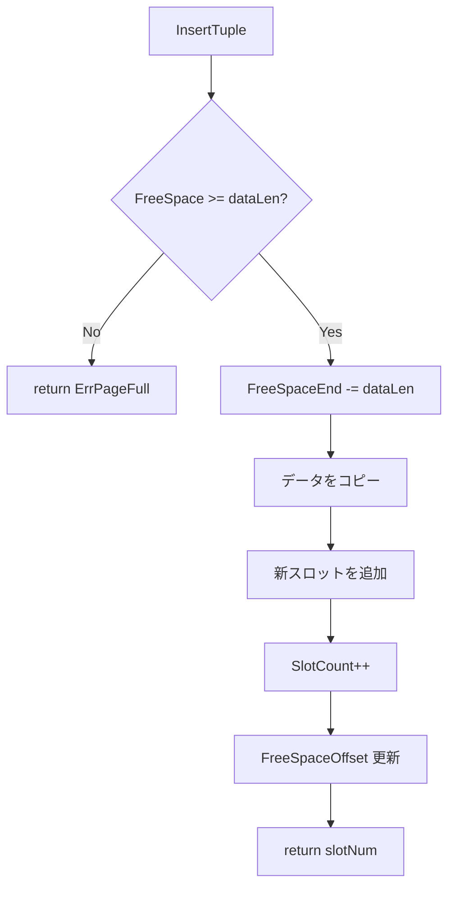
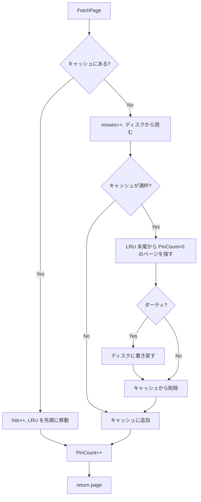
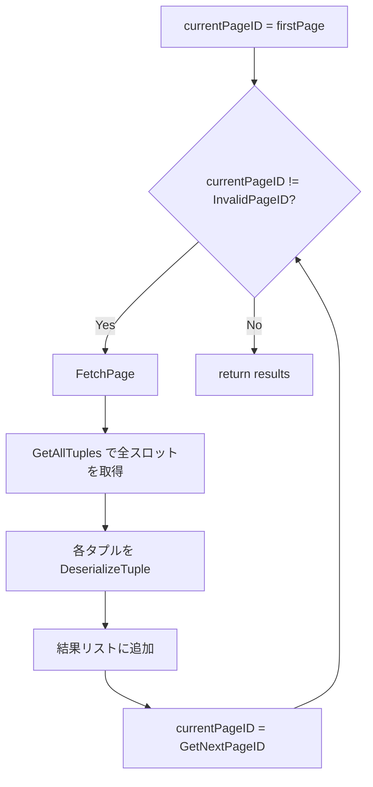
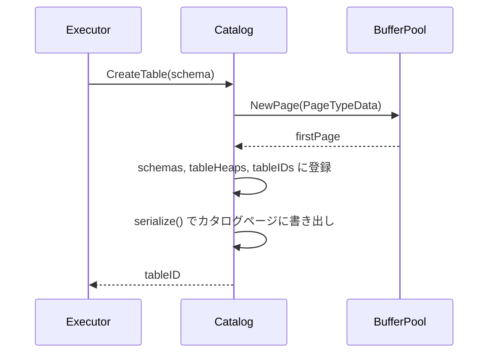

# ストレージエンジン

ディスク上のデータを管理するための最下位レイヤー。ページの読み書き、バッファキャッシュ、テーブルデータの格納を担当する。

対応ソース: `internal/storage/page.go`, `disk.go`, `buffer.go`, `heap.go`

---

## 1. スロットページ

### なぜスロット方式か

固定長レコードなら「ページ先頭から詰めて配置」で済むが、可変長レコードを扱うには**レコード位置の間接参照**が必要になる。スロットページ（Slotted Page）方式では、ページ内にスロット配列（インダイレクション層）を設け、各スロットがタプルの実際のオフセットと長さを保持する。これにより：

- タプルの移動（コンパクション）時にスロット番号を変えずに済む
- 外部からは `(PageID, SlotNum)` で安定的にタプルを参照できる
- 削除はスロットの長さを 0 にするだけで済む

### ページレイアウト

```
4096 bytes (PageSize)
┌──────────────────────────────────────┐  offset 0
│          Header (28 bytes)           │
├──────────────────────────────────────┤  offset 28
│  Slot 0  │  Slot 1  │  Slot 2  │... │  ← スロット配列（前方に成長）
│ [off|len]│ [off|len]│ [off|len]│    │    各スロット 4 bytes
├──────────────────────────────────────┤  FreeSpaceOffset
│                                      │
│           Free Space                 │
│                                      │
├──────────────────────────────────────┤  FreeSpaceEnd
│  Tuple 2 data  │  Tuple 1 data  │...│  ← タプルデータ（後方に成長）
└──────────────────────────────────────┘  offset 4096
```

スロット配列はヘッダ直後から**前方**に成長し、タプルデータはページ末尾から**後方**に成長する。この双方向成長により、空き領域を最大限活用できる。

### ヘッダフォーマット（28 バイト）

```
offset  size  field
─────────────────────────────────
 0      4     PageID          ページ番号
 4      1     PageType        1=Data, 2=BTree, 3=Catalog
 5      3     Reserved        予約領域
 8      8     LSN             このページに最後に書き込んだログの LSN
16      2     SlotCount       スロット数
18      2     FreeSpaceOffset スロット配列の末尾（＝空き領域の開始）
20      2     FreeSpaceEnd    タプルデータの先頭（＝空き領域の終了）
22      4     NextPageID      次のページへのリンク（ヒープ用）
26      2     Reserved        予約領域
```

`FreeSpace = FreeSpaceEnd - FreeSpaceOffset - slotSize(4)` で、新しいスロット 1 つ分を引いた空き容量が計算される。

### スロットフォーマット（4 バイト）

```
offset  size  field
─────────────────────
 0      2     Offset  タプルデータのページ内オフセット
 2      2     Length  タプルデータの長さ（0 = 削除済み）
```

### 挿入アルゴリズム



### 更新アルゴリズム

- 新データが旧データ以下のサイズ → 既存位置に上書き
- 新データが旧データより大きい → 旧スロットを削除扱い（length=0）にし、新たにページ末尾から領域を確保して再配置

### 削除

スロットの `Length` を 0 に設定するだけ。タプルデータ自体は残るが、以降の読み取りでスキップされる。

---

## 2. ディスクマネージャ

### 役割

ファイル I/O を抽象化し、ページ単位の読み書きを提供する。

### ファイルフォーマット

```
┌─────────────────────────────────────┐  offset 0
│ File Header (16 bytes)              │
│   Magic: 0x4D494E4944425044        │  "MINIDBPD" (8 bytes)
│   Version: 1                        │  (4 bytes)
│   NumPages: N                       │  (4 bytes)
├─────────────────────────────────────┤  offset 16
│ Page 0 (4096 bytes)                 │
├─────────────────────────────────────┤  offset 4112
│ Page 1 (4096 bytes)                 │
├─────────────────────────────────────┤
│ ...                                 │
└─────────────────────────────────────┘
```

### ページオフセット計算

```
pageOffset(pageID) = diskHeaderSize(16) + pageID × PageSize(4096)
```

### 主要操作

| 操作 | 説明 |
|------|------|
| `ReadPage(pageID)` | ファイルの指定オフセットから 4096 バイトを読み、Page を返す |
| `WritePage(page)` | Page を指定オフセットに書き込む |
| `AllocatePage()` | NumPages をインクリメントし、空ページをディスクに書き込んで返す |
| `Sync()` | `fsync` でバッファをディスクに強制書き込み |

すべての操作は `sync.Mutex` で保護されている。

---

## 3. バッファプール

### なぜ必要か

毎回ディスクからページを読み書きすると遅い。バッファプールはメモリ上にページをキャッシュし、ディスク I/O を削減する。データベースの性能はバッファプールのヒット率に大きく依存する。

### LRU エビクション



LRU リストは Go の `container/list` で実装。最近アクセスされたページはリスト先頭に、最も古いページはリスト末尾に位置する。

### Pin / Unpin プロトコル

- **FetchPage**: ページを返すとき `PinCount++`。利用中のページはエビクション対象にならない
- **UnpinPage**: 利用終了時に `PinCount--`。`isDirty=true` を渡すとページにダーティフラグが立つ
- エビクション時は `PinCount == 0` のページのみ対象

```go
page, _ := bufferPool.FetchPage(pageID)  // PinCount = 1
// ... ページを使う ...
bufferPool.UnpinPage(pageID, true)         // PinCount = 0, dirty = true
```

### ダーティページのフラッシュ

- `FlushPage(pageID)`: 特定のダーティページをディスクに書き出す
- `FlushAllPages()`: 全ダーティページを書き出し + `fsync`
- エビクション時にダーティなら自動的に書き出す

### 統計情報

`Stats()` でキャッシュヒット数、ミス数、現在のキャッシュページ数を取得できる。REPL の `stats` コマンドで表示される。

---

## 4. テーブルヒープ

### なぜヒープ構造か

ヒープ（Heap）は最もシンプルなテーブル格納方式で、タプルを追加順に格納する。B-Tree のような順序保証はないが、全件スキャンが効率的で実装が単純。

### ページリンクリスト

テーブルのページは `NextPageID` フィールドにより**リンクリスト**で連結される。連続するページ番号を仮定しないため、ページが非連続に配置されても正しく動作する。


### 挿入

1. `lastPage` を FetchPage
2. タプルをシリアライズして `InsertTuple`
3. ページが満杯（`ErrPageFull`）なら：
   - 新ページを `NewPage` で確保
   - 旧 `lastPage` の `NextPageID` を新ページに設定
   - `lastPage` を新ページに更新
   - 新ページに挿入

### Scan アルゴリズム



`InvalidPageID = 0xFFFFFFFF`（ページ 0 は有効なページなので、0 は使えない）。

---

## 5. カタログ

### 役割

テーブルのメタデータ（スキーマ、ページ位置、インデックスルート）を管理する。カタログ自体も 1 ページに直列化されて保存される。

### 直列化フォーマット

カタログページ（`PageType = 3`）のデータ領域（ヘッダ 28 バイト以降）：

```
offset  field
──────────────────────────────────────
 0      NumTables (4 bytes)
 4      NextTableID (4 bytes)
 8      --- テーブルエントリ繰り返し ---
        TableID (4)
        TableNameLen (2) + TableName (可変)
        FirstPage (4)
        LastPage (4)
        IndexRoot (4)   ← InvalidPageID なら未作成
        NumColumns (2)
        --- カラム定義繰り返し ---
            ColNameLen (2) + ColName (可変)
            ColType (1)    ← 0=Null, 1=Int, 2=String, 3=Bool
            Nullable (1)   ← 0 or 1
```

### テーブル作成の流れ


