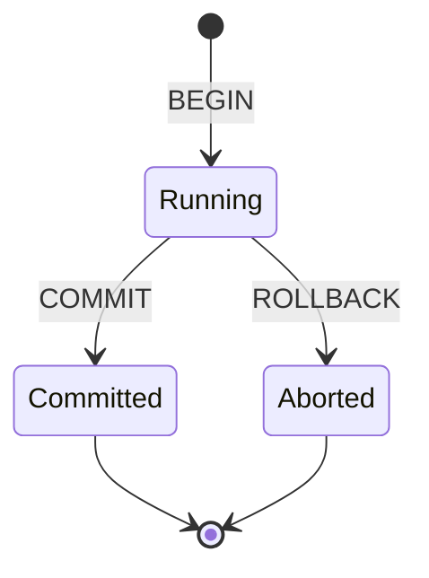
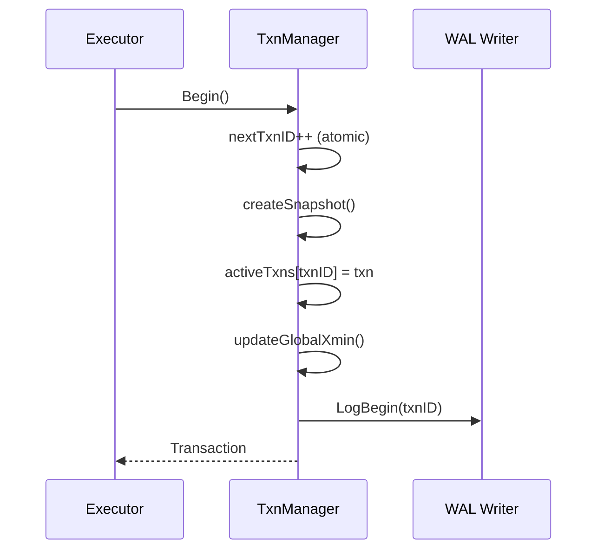
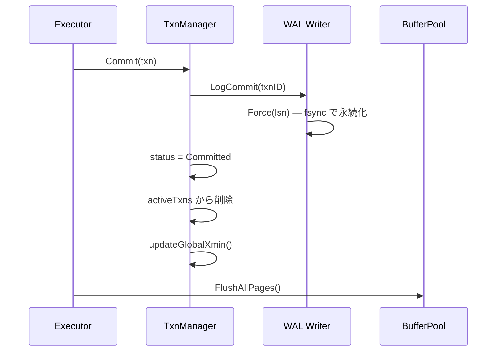
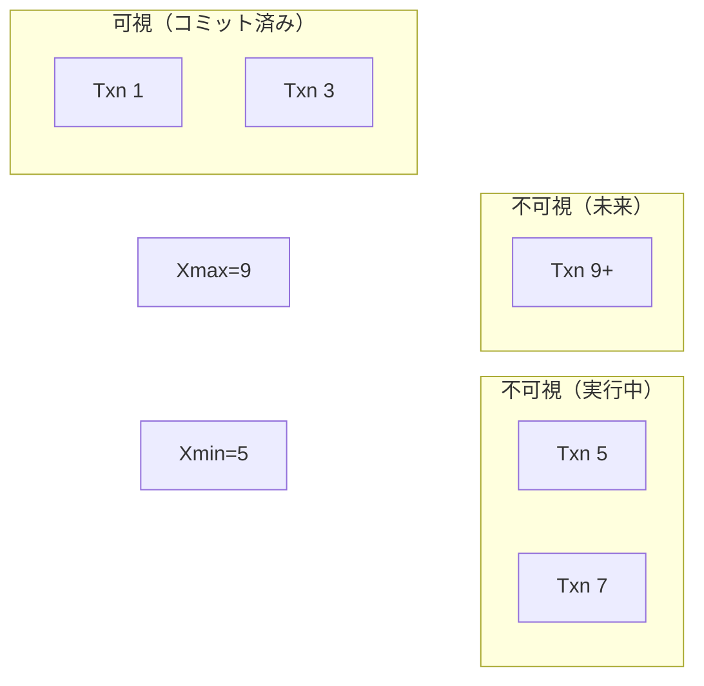
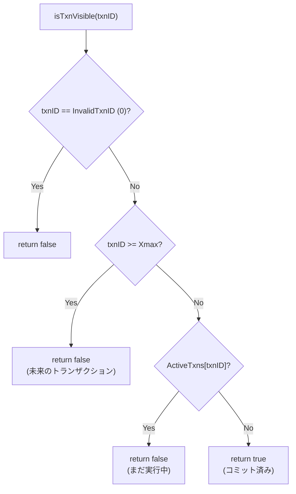
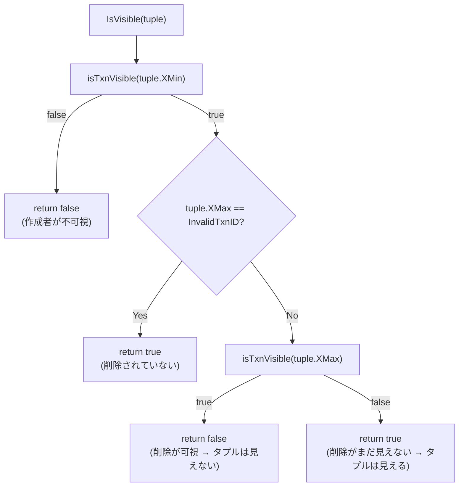
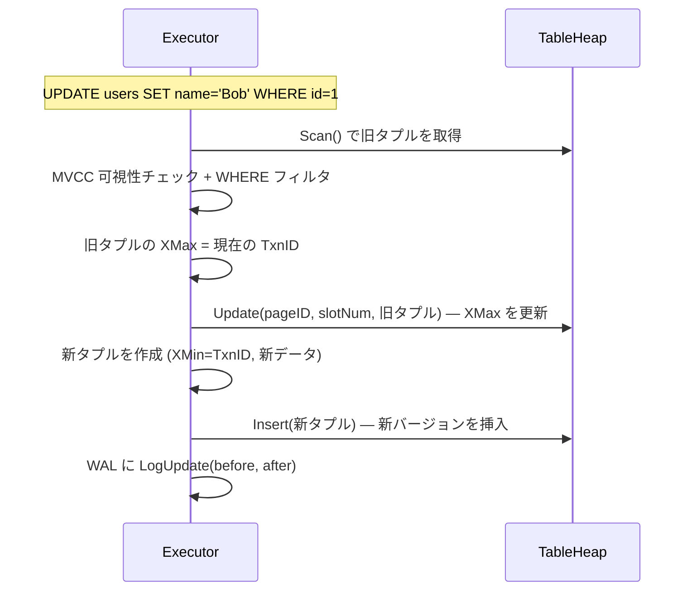
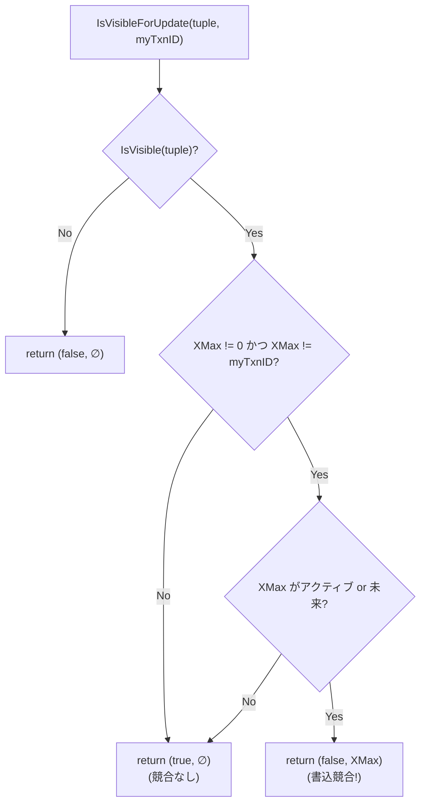
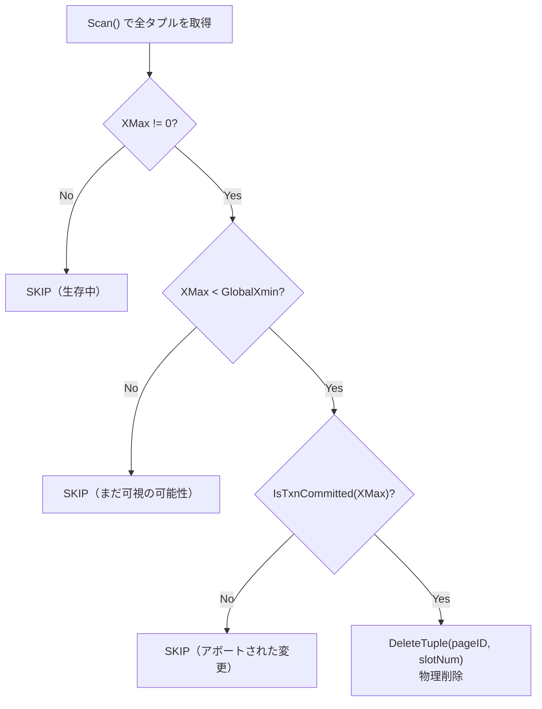
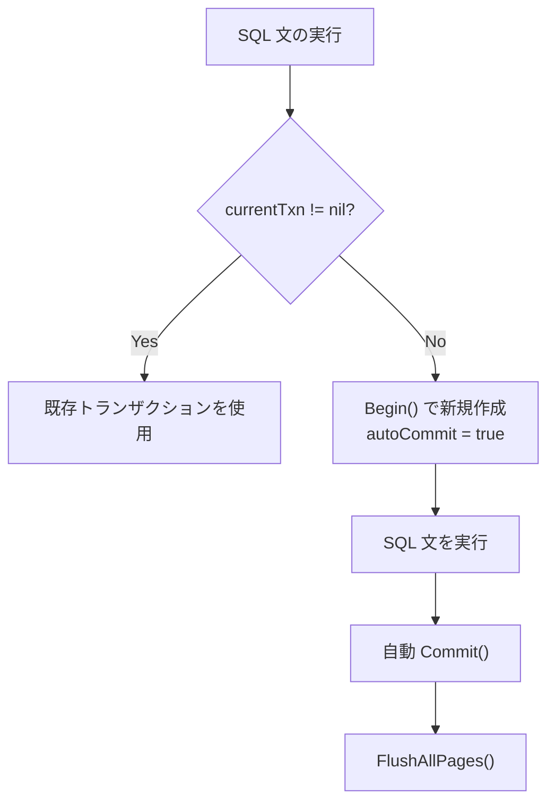

# トランザクションと MVCC

トランザクションの分離性と一貫した読み取りを実現する仕組み。各トランザクションは開始時点のスナップショットを通じてデータを見る。

対応ソース: `internal/txn/transaction.go`, `mvcc.go`, `internal/sql/executor.go`

---

## 1. トランザクション管理

### Begin / Commit / Rollback のライフサイクル



### TxnID の割り当て

TxnID は `uint64` のアトミックカウンタで生成される。単調増加するため、TxnID の大小関係は時間順序を表す。

```go
txnID := types.TxnID(atomic.AddUint64(&m.nextTxnID, 1))
```

### Begin の処理



### Commit の処理



**重要**: WAL の COMMIT レコードが Force された時点でコミットは確定する。データページのフラッシュはその後でよい（No-Force ポリシー）。

### Rollback の処理

```go
txn.Status = TxnStatusAborted
walWriter.LogAbort(txnID)
delete(activeTxns, txnID)
```

ロールバック時のデータの巻き戻しは、リカバリの Undo フェーズと同じメカニズムで行われる。

---

## 2. スナップショット分離

### Snapshot の構造

トランザクション開始時に、その時点で「見える」トランザクションの範囲を記録する。

```go
type Snapshot struct {
    Xmin       TxnID              // アクティブな最小 TxnID
    Xmax       TxnID              // 次に割り当てられる TxnID
    ActiveTxns map[TxnID]bool     // スナップショット時点のアクティブ TxnID
}
```



- `TxnID < Xmin`: 確実にコミット済み → **可視**
- `TxnID >= Xmax`: スナップショット後に開始 → **不可視**
- `Xmin <= TxnID < Xmax` かつ `ActiveTxns` に含まれる → **不可視**（まだ実行中）
- `Xmin <= TxnID < Xmax` かつ `ActiveTxns` に含まれない → **可視**（コミット済み）

---

## 3. MVCC 可視性ルール

### タプルの MVCC メタデータ

```go
type Tuple struct {
    XMin    TxnID     // このバージョンを作成したトランザクション
    XMax    TxnID     // このバージョンを削除したトランザクション（0 = 生存中）
    Cid     CommandID // トランザクション内のコマンド順序
    TableID uint32
    RowID   uint64
    Data    []byte    // 実際の行データ（バイナリ）
}
```

### isTxnVisible — トランザクションの可視性判定



### IsVisible — タプルの可視性判定



3 つのルールをまとめると：

| ルール | 条件 | 結果 |
|--------|------|------|
| 1 | 作成トランザクション（XMin）が不可視 | タプル不可視 |
| 2 | XMax が無効（未削除） | タプル可視 |
| 3 | 削除トランザクション（XMax）が可視 | タプル不可視 |

---

## 4. タプルのライフサイクル

### INSERT

```
Tuple { XMin=T1, XMax=0, Data=... }
```

T1 が INSERT すると、XMin=T1、XMax=0（InvalidTxnID）のタプルが作成される。T1 がコミットするまで、他のトランザクションからは見えない。

### DELETE

```
Before: Tuple { XMin=T1, XMax=0, Data=... }
After:  Tuple { XMin=T1, XMax=T2, Data=... }
```

T2 が DELETE すると、既存タプルの XMax を T2 に設定する。タプル自体は削除されず、T2 がコミットした後のスナップショットからは見えなくなる。

### UPDATE

UPDATE は「旧バージョンの DELETE + 新バージョンの INSERT」として実装される：

```
旧: Tuple { XMin=T1, XMax=T2, Data=old }  ← XMax を T2 に設定
新: Tuple { XMin=T2, XMax=0, Data=new }   ← 新タプルを挿入
```



---

## 5. 書込競合検出

### IsVisibleForUpdate

UPDATE/DELETE 時に、他のトランザクションが同じタプルを変更中でないかチェックする。

```go
func (s *Snapshot) IsVisibleForUpdate(tuple *Tuple, myTxnID TxnID) (visible bool, conflict TxnID) {
    // 基本的な可視性チェック
    if !s.IsVisible(tuple) {
        return false, InvalidTxnID
    }

    // 他のアクティブなトランザクションが XMax を設定している？
    if tuple.XMax != InvalidTxnID && tuple.XMax != myTxnID {
        if s.ActiveTxns[tuple.XMax] || tuple.XMax >= s.Xmax {
            // 書込-書込競合
            return false, tuple.XMax
        }
    }

    return true, InvalidTxnID
}
```



---

## 6. VACUUM — デッドタプルのガベージコレクション

### 問題

UPDATE/DELETE は MVCC の仕組みにより旧バージョンの XMax を設定するだけで、物理的にはタプルを削除しない。これらの「デッドタプル」が蓄積し続けると、ストレージが肥大化し、Scan のパフォーマンスも劣化する。

### デッドタプルの判定条件

タプルが安全に回収可能な条件（3 つ全て満たす）:

| # | 条件 | 理由 |
|---|------|------|
| 1 | `XMax != InvalidTxnID` | 削除マークが付いている |
| 2 | `XMax < GlobalXmin` | 全アクティブトランザクションから不可視 |
| 3 | XMax のトランザクションがコミット済み | アボートされた DELETE/UPDATE は回収しない |



### アボートされたトランザクションの扱い

ROLLBACK 時、ヒープページ上の XMax 変更はランタイムでは戻されない（ARIES crash recovery の Undo でのみ復元される）。そのため、VACUUM がアボートされたトランザクションの XMax を持つタプルを誤って回収しないよう、`TxnManager` が `committedTxns` マップでコミット済みトランザクションを追跡する。

```go
// Commit 時に記録
m.committedTxns[txn.ID] = true

// VACUUM 時に確認
if m.IsTxnCommitted(xmaxTxnID) {
    // 安全に回収可能
}
```

### WAL ログ

VACUUM は WAL ログを書かない。VACUUM は冪等な操作であり、クラッシュ後に再実行しても同じ結果になるため、リカバリの対象にする必要がない。

### 使用例

```
minidb> DELETE FROM users WHERE id = 1
DELETE 1

minidb> vacuum
VACUUM: removed 1 dead tuples.
  users: scanned 3, removed 1

minidb> vacuum
VACUUM: removed 0 dead tuples.
```

---

## 7. Auto-Commit

### 単文の暗黙トランザクション

明示的な `BEGIN` なしで実行される SQL 文には、自動的にトランザクションが割り当てられる。

```go
func (e *Executor) getTransaction() (*txn.Transaction, bool) {
    if e.currentTxn != nil {
        return e.currentTxn, false   // 明示トランザクション
    }
    return e.txnManager.Begin(), true // Auto-Commit (autoCommit=true)
}
```

Auto-Commit の場合、SQL 文の実行後に自動的に `Commit()` が呼ばれる。これにより、単一の INSERT や SELECT でも MVCC の可視性ルールが正しく適用される。


