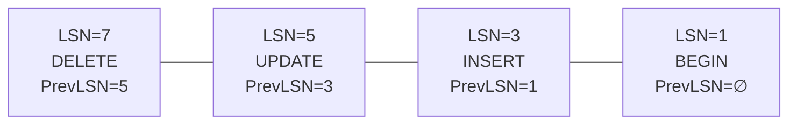
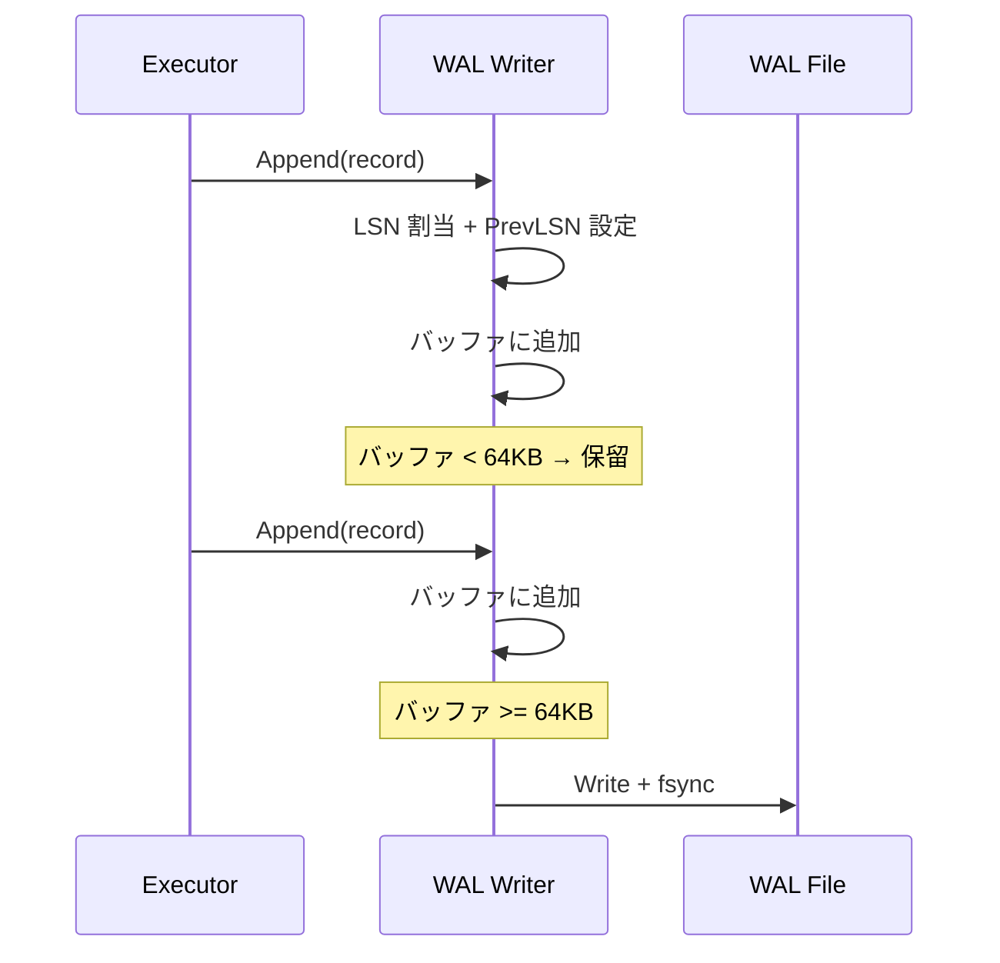
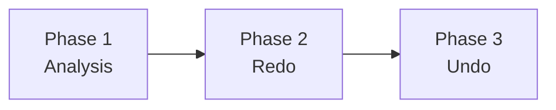
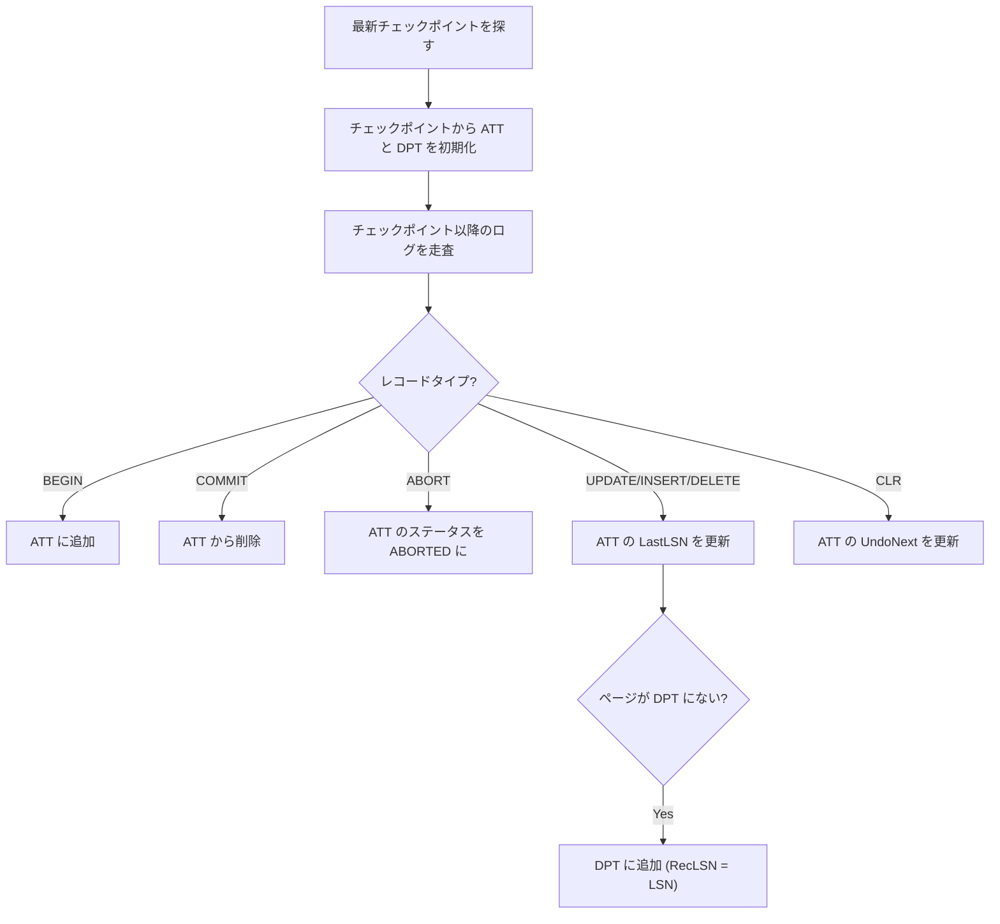
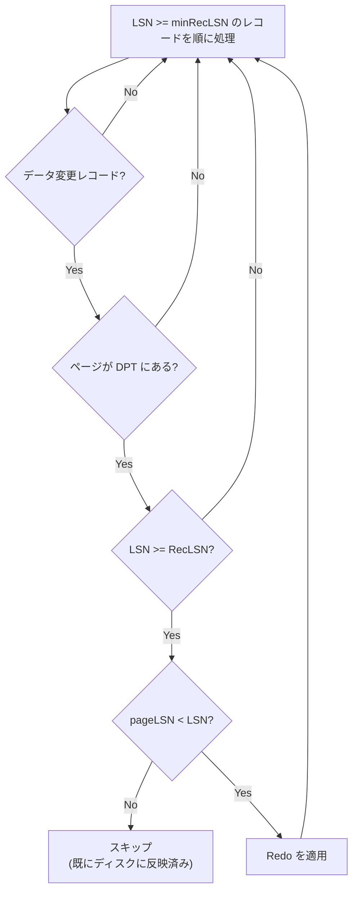
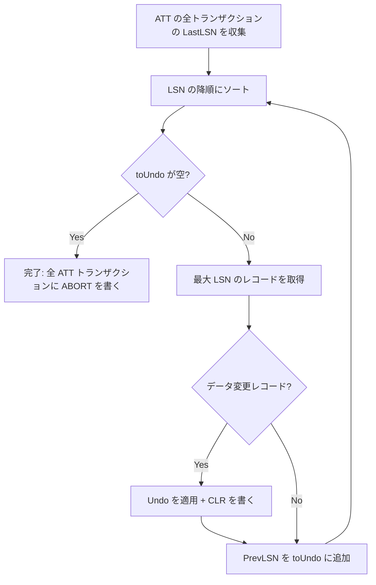
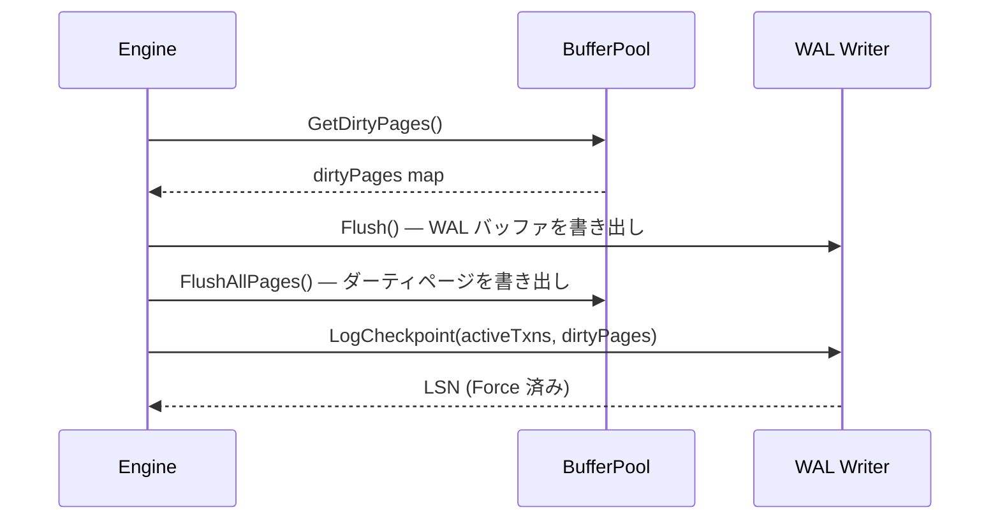

# WAL と ARIES リカバリ

クラッシュ時にもデータの一貫性を保証するための仕組み。ログを先に書くことで永続性（Durability）を実現し、ARIES アルゴリズムで障害回復を行う。

対応ソース: `internal/wal/log.go`, `writer.go`, `recovery.go`

---

## 1. Write-Ahead Logging の原理

### なぜログを先に書くか

データベースの変更をディスクに書く方法は 2 つある：

1. **データページを直接更新** — ランダム I/O、複数ページにまたがる変更は中途半端な状態になりうる
2. **ログに変更内容を記録してから、後でデータページに反映** — シーケンシャル I/O で高速、クラッシュ時にログから復元可能

WAL（Write-Ahead Logging）は方式 2 を採用する。核心的なルールは：

> **データページをディスクに書く前に、対応するログレコードが必ずディスクに永続化されていなければならない**

これにより、クラッシュ後にログを読むだけで、どの変更が完了していてどの変更が未完了かを判定できる。

### Steal / No-Force

minidb は **Steal / No-Force** ポリシーを採用する：

- **Steal**: コミット前のダーティページをディスクに書き出してもよい（バッファプールのエビクション時）
- **No-Force**: コミット時にデータページのディスク書き出しを強制しない（ログの Force だけ行う）

このポリシーにより高い性能が得られるが、リカバリが複雑になる（ARIES が必要になる理由）。

---

## 2. WAL ファイルフォーマット

### ファイルヘッダ（16 バイト）

```
offset  size  field
──────────────────────
 0      8     Magic     0x4D494E4944425741 ("MINIDBWA")
 8      4     Version   1
12      4     Reserved
```

### レコードの配置

ヘッダの後にログレコードが連続して並ぶ。各レコードは **長さプレフィックス（4 バイト）** に続いてレコード本体が格納される。

```
┌───────────┬──────────────────────┐
│ len (4B)  │ LogRecord (len B)    │
├───────────┼──────────────────────┤
│ len (4B)  │ LogRecord (len B)    │
├───────────┼──────────────────────┤
│ ...       │ ...                  │
└───────────┴──────────────────────┘
```

---

## 3. ログレコード

### ヘッダフォーマット（51 バイト）

```
offset  size  field
───────────────────────────────
 0      8     LSN           ログシーケンス番号（単調増加）
 8      8     PrevLSN       同一トランザクション内の前レコードの LSN
16      8     TxnID         トランザクション ID
24      1     Type          レコードタイプ
25      4     TableID       テーブル ID
29      8     RowID         行 ID
37      4     PageID        対象ページ ID
41      2     SlotNum       対象スロット番号
43      4     BeforeLen     Before Image の長さ
47      4     AfterLen      After Image の長さ
```

ヘッダの後に `BeforeImage`（Undo 用）と `AfterImage`（Redo 用）が続く。

### レコードタイプ

| Type | 値 | 用途 | Before | After |
|------|---|------|--------|-------|
| BEGIN | 0 | トランザクション開始 | - | - |
| COMMIT | 1 | トランザクションコミット | - | - |
| ABORT | 2 | トランザクションアボート | - | - |
| UPDATE | 3 | 行の更新 | 旧タプル | 新タプル |
| INSERT | 4 | 行の挿入 | - | 新タプル |
| DELETE | 5 | 行の削除 | 旧タプル | - |
| CHECKPOINT | 6 | チェックポイント | - | - |
| CLR | 7 | Compensation Log Record（Undo 中の補償記録） | - | Undo データ |

### CHECKPOINT レコードの追加データ

通常のヘッダに加え、チェックポイントレコードにはアクティブトランザクションとダーティページの情報が付加される：

```
[checkpointDataLen (4)]
[NumActiveTxns (4)] [TxnID (8)]...
[NumDirtyPages (4)] [PageID (4) + RecLSN (8)]...
```

### CLR レコードの追加データ

ヘッダの後に `UndoNextLSN (8)` が付加される。これは Undo チェーンの次の LSN を指し、リカバリ中に同じ操作を二重に Undo しないために使う。

---

## 4. PrevLSN チェーン

### 概念

各トランザクションのログレコードは `PrevLSN` で**逆方向にリンク**される。これにより、Undo 時にトランザクションのすべての操作を新しい順に辿ることができる。



Undo 時は最新の LSN から `PrevLSN` を辿って BEGIN まで逆走する。

### WAL Writer での管理

```go
// Append 時に PrevLSN を自動設定
if prev, ok := w.txnLastLSN[record.TxnID]; ok {
    record.PrevLSN = prev       // 前回の LSN
} else {
    record.PrevLSN = InvalidLSN // トランザクション最初のレコード
}
w.txnLastLSN[record.TxnID] = record.LSN  // 更新
```

---

## 5. バッファリングと Force

### 64KB バッファ

WAL Writer は 64KB のインメモリバッファを持ち、ログレコードをバッファに蓄積する。バッファが満杯になると自動的にディスクに書き出される。



### Flush vs Force

| 操作 | 説明 |
|------|------|
| `Flush()` | バッファの全レコードをディスクに書き出す |
| `Force(lsn)` | 指定 LSN まで確実にディスクに書き出す。既にフラッシュ済みなら何もしない |

### コミット時の fsync

```go
func (w *Writer) LogCommit(txnID) (LSN, error) {
    lsn := w.Append(&LogRecord{Type: COMMIT, TxnID: txnID})
    // CRITICAL: COMMIT レコードの永続化を保証
    w.Force(lsn)  // Write + fsync
    return lsn, nil
}
```

COMMIT レコードがディスクに書かれた時点で、そのトランザクションは**永続的にコミット**された扱いになる。これが WAL の核心。

---

## 6. ARIES 3 フェーズリカバリ

### 概要

ARIES（Algorithm for Recovery and Isolation Exploiting Semantics）は、クラッシュ後に以下の 3 フェーズでデータベースを一貫した状態に復元する。



### Phase 1: Analysis（分析）

**目的**: クラッシュ時点のデータベース状態を把握する。具体的には以下の 2 つのテーブルを再構築する：

- **ATT（Active Transaction Table）**: クラッシュ時に実行中だったトランザクションの一覧
- **DPT（Dirty Page Table）**: ディスクに書き戻されていない可能性のあるページの一覧。各エントリは `PageID → RecLSN`（そのページを最初にダーティにしたログの LSN）



### Phase 2: Redo（再実行）

**目的**: クラッシュ前にディスクに書かれていなかった変更を再適用する。コミット済み・未コミットの**両方**の変更を再適用する（Repeating History）。

Redo の開始点は DPT 内の**最小 RecLSN**。各レコードについて以下の条件をすべてチェックする：



`pageLSN >= LSN` の場合、そのページには既にこの変更が反映されているのでスキップする。これにより Redo は**冪等**（何度実行しても同じ結果）になる。

### Phase 3: Undo（取消）

**目的**: ATT に残っている未コミットトランザクションの変更をロールバックする。

各トランザクションの `LastLSN` から `PrevLSN` チェーンを逆走し、変更を取り消す。Undo 操作ごとに CLR（Compensation Log Record）を書く。



CLR の `UndoNextLSN` は元レコードの `PrevLSN` を指す。これにより、リカバリ中にクラッシュしても同じ操作を二重に Undo することがない。

---

## 7. チェックポイント

### なぜ必要か

リカバリ時にログ全体を走査するのは時間がかかる。チェックポイントを定期的に書くことで、Analysis フェーズの開始点を最新のチェックポイントに限定できる。

### 処理順序



順序が重要：

1. ダーティページ情報を**取得**（この時点のスナップショット）
2. WAL をフラッシュ（ログが先！）
3. データページをフラッシュ
4. チェックポイントレコードを書いて Force

---

## 8. minidb での Redo / Undo 実装

リカバリマネージャはコールバック関数を通じて実際のデータ操作を行う。Engine が以下のコールバックを設定する：

### applyRedo

ログレコードの AfterImage（新しいタプルデータ）を対象ページに書き込む：

- **INSERT**: AfterImage をページの指定スロットに挿入
- **UPDATE**: AfterImage でページの指定スロットを上書き
- **DELETE**: 指定スロットを削除（length=0）

### applyUndo

ログレコードの BeforeImage（古いタプルデータ）で変更を巻き戻す：

- **INSERT**: 挿入されたスロットを削除
- **UPDATE**: BeforeImage でスロットを上書き
- **DELETE**: BeforeImage をスロットに復元

これらは MVCC ストアではなく、実際のヒープページに対して操作する。
